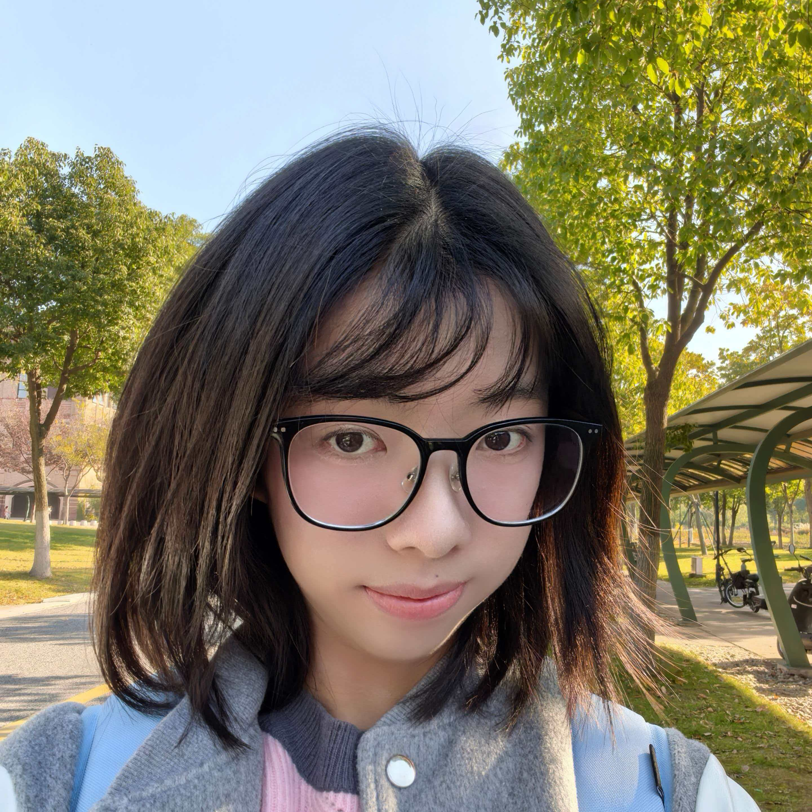

## Welcome to my personal webpage! 

My name is Ma Shufan. 
I am an IBI1 student at the Zhejiang University - University of Edinburgh (ZJE) Institute.

You can see the ZJE website [here](https://zje.zju.edu.cn/zje/main.htm)

## About Me

  

I am interested in biomedical science and exploring new knowledge.

I am an INFP. I am a contemplative person and I enjoy being lost in thought.

## Things I Like

- Music
- Chocolate
- Cat
- Reading

## Links

- My GitHub is [here](https://github.com/fanfan-ma) 
